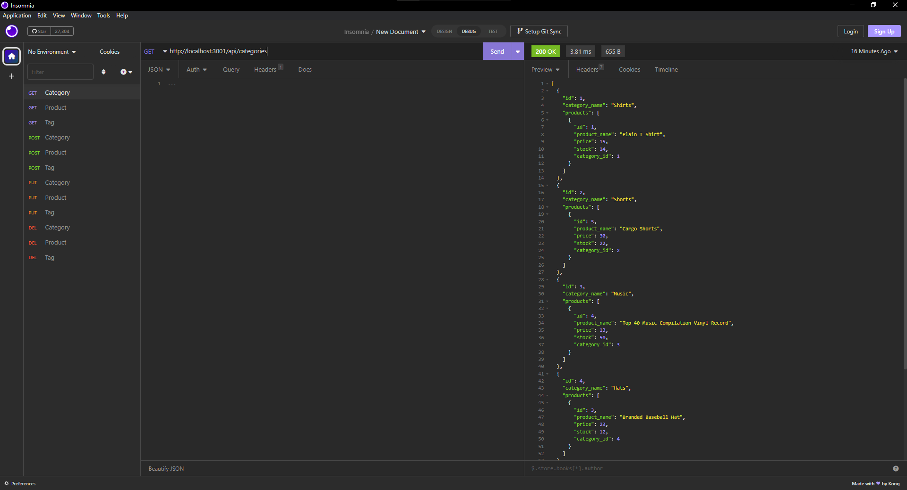

# E-Commerce: Back-End

## Description

This project builds the back-end of an E-Commerce website by using Express.js API and Sequilize to interact with a MySQL database. You can add/delete/update Products, Categories, and Tags.

## Table of Contents

- [Project Links](#links)
- [Usage](#usage)
- [Screenshots](#screenshots)
- [Credits](#credits)
- [License](#license)
- [Contributing](#contributing)
- [Tests](#tests)
- [Questions](#questions)

## Links

- [Walkthrough Video](https://drive.google.com/file/d/1oFGMK-TM3e98Wqf1gIIqAMq4079ldNvw/view)
- [GitHub Repo](https://github.com/jeaustins27/E-Commerce)

## Usage

To get started, clone the repo onto your machine. Once cloned, you will need to add your information into the .env file. Then you will need to generate the database by using the prompts in the "schema.sql" file found in the "db" folder in MySQL Workbench. You will then need to seed your database by entering "npm run seed" in the command line. Once your database has been created and seeded, you will need to install the necessary packages by using "npm install" in the command line. Once all packages have been installed, use "npm start" in the command line to run the application. You will then need to open Insomnia to read or modify any data. Follow the correct /api routes to correctly pull, add , modify, and/or delete data from the database.

## Screenshots

## Credits

- [W3Schools](https://www.w3schools.com/)
- [Readme.so](https://readme.so/)
- [Stack Overflow](https://stackoverflow.com)
- [MySQL-W3Schools](https://www.w3schools.com/MySQL/default.asp)

## License

This project is licensed under the [MIT](https://choosealicense.com/licenses/mit/) license.

## Contributing

You can help with contributing by reaching me via email.

## Tests

There are no current tests to be ran.

## Questions

If you have any questions you can reach out via [Email](mailto:JeaustinS27@gmail.com) or you can check out my GitHub profile at here: [GitHub](https://github.com/jeaustins27)
